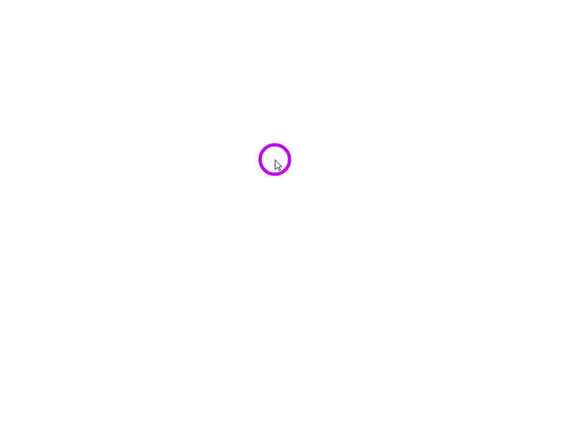
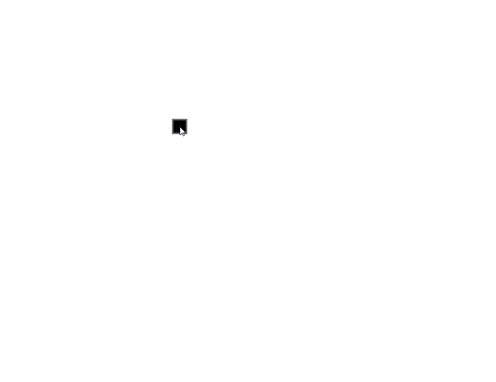
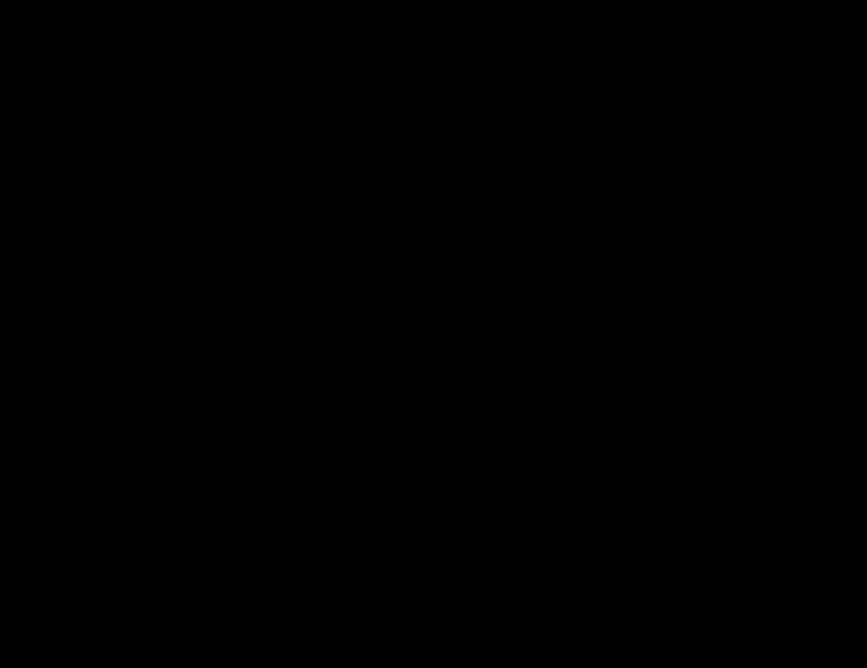

# jq-dots

### What is jq-dots
jq-dots is a jquery animation plugin which lets you show a cloud of beautiful dots around your mouse pointer easily.

<div align=center>

</div>

### How to download it
Just download or clone the [jq_dots.js](https://github.com/yiyiyeye2/jq-dots/blob/master/jq_dots.js) file and add to your project.
  
  
jQuery is needed for this plugin.

### How to use it
Just use it as a jQuery function:
* Add a canvas in html
```html
<canvas id="test"></canvas> 
```
* Use the function `.jq_dots()`, and give the function an argument `'option'`(if there is no argument, the function would use the default settings)
```javascript
var option = {
		'the_size':{'x':1000,'y':1000},
		'the_speed':0.75,
		'the_num':30,
		'the_radius':20,
		'the_dispersion':0.09,
		'the_filledColor':'#FFFFFF',
		'the_borderColor':'#E1E1E1',
		'the_shape': 'star5'
	};
	$(function(){
		$('#test').jq_dots();
	});
```
### How to customize your cloud

Name|Description
---|---
`the_size`| 'the_size' is an object which has two keys: x and y. It sets the size of the canvas you created;
`the_speed`| 'the_speed' sets the movement speed of dots, the range of 'speed' is (0, 1);
`the_num`| 'the_num' is the number of dots;
`the_radius`| 'the_radius' sets the radius of these dots;
`the_dispersion`| The value is (0, 0.1) which measures the dispersion of the dots clouds. With the value increasing the clouds becomes more dispersed.
`the_filledColor`| Set the color inside the dots.
`the_borderColor`| Set the border color of the dots.
`the_shape`| You could have `dots cloud`, `rectangle cloud` and `star cloud`. The options are `'dot'`, `'rec'`, `'star4'`, `'star5'` and `'star8'`. The default is `'dot'`.

### Example
**--rectangle style--**
<div align=center>

</div>
<br>

**--star style--**
<div align=center>

</div>

### License
Released under the MIT License.  

This repository contains other libraries that may or may not fall under the same license:
* [jQuery](https://github.com/jquery/jquery)

Copyright (c) 2017 yiyiyeye2
  
  


